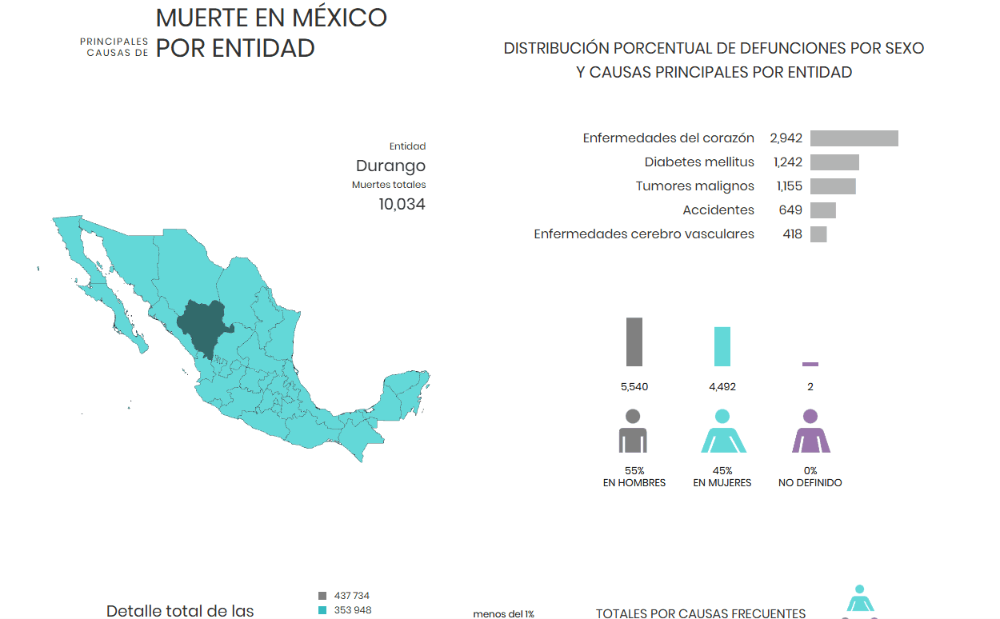
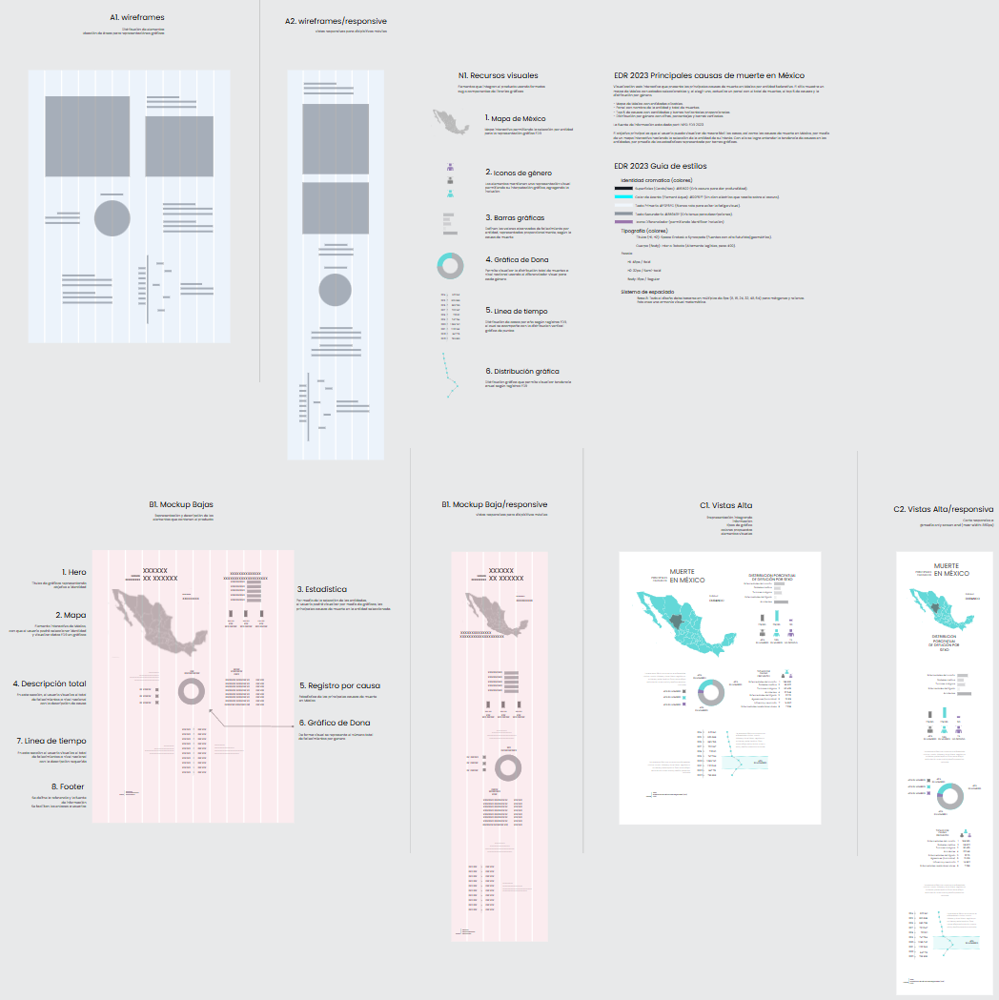

<div align="center">

  
  

## EDR 2023 Causas de muerte en México por entidad


  <h3> 
   <a href="https://megadatogit.github.io/Elemento09/"></a> Ver Demo En Vivo</a> 
   
  </h3>
</div>

---


### 📝 Descripción
**EDR 2023** Visualización web interactiva que presenta las principales causas de muerte en México por entidad federativa. El sitio muestra un mapa de México con estados seleccionables y, al elegir uno, actualiza un panel con el total de muertes, el top 5 de causas y la distribución por género.


## Qué incluye
- Mapa de México con entidades clicables.
- Panel con nombre de la entidad y total de muertes.
- Top 5 de causas con cantidades y barras horizontales proporcionales.
- Distribución por género con cifras, porcentajes y barras verticales.

### 📂 Estructura del Proyecto

| Archivo | Tipo | Descripción |
| --- | --- | --- |
| **`ele09.html`** | `HTML5` | Estructura principal y contenedor de los elementos SVG del mapa. |
| **`ele09.css`** | `CSS3` | Estilos de maquetación, visuales y diseño responsivo. |
| **`ele09.js`** | `JS` | Lógica de interacción, carga de datos y animaciones. |
| **`datos.json`** | `JSON` | Dataset con causas, totales y género por entidad. |
| **`favicon.svg`** | `SVG` | Ícono oficial del sitio. |

### 🎨 Proceso de Diseño (UI/UX)
Para este proyecto, el flujo de trabajo comenzó en **Penpot**. Se trabajó en:
* **Composición:** Distribución de elementos visuales siguiendo jerarquías claras.
* **Tipografía:** Selección de fuentes que refuercen la identidad del sitio.
* **Color:** Paleta de colores seleccionada para transmitir la esencia del "Elemento 09".


> Puedes ver el archivo de diseño interactivo directamente en mi tablero de Penpot.



### 🚀 Instalación y Uso
Si quieres explorar el código localmente:

1. Clona el repositorio:
   ```bash
   git clone [https://github.com/megadatogit/Elemento09.git](https://github.com/megadatogit/Elemento09.git)